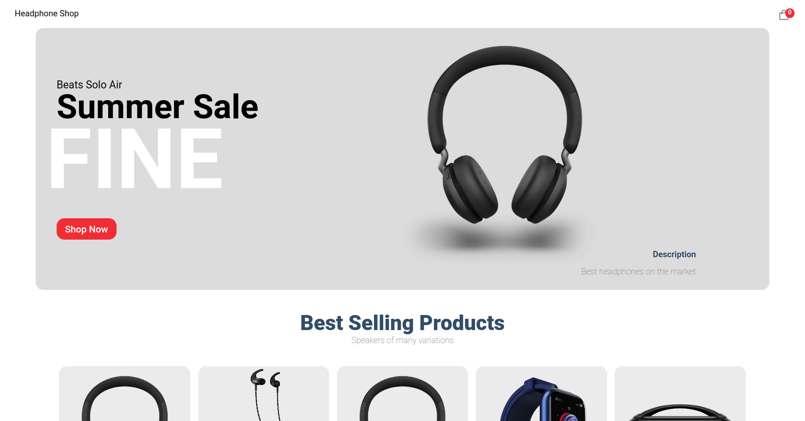

# Modern Ecommerce Website
[demo](https://kushaj-ecommerce-website.vercel.app/)



- Developed and deployed a fully responsive, modern full-stack e-commerce application on Vercel using React/Next.js/TypeScript with integrated Stripe payments, advanced cart functionalities, and dynamic content management using Sanity for seamless content updates.
- Employed advanced React and Next.js best practices, such as hooks, refs, state management with React Context API, file-based routing, server-side rendering, and static generation for optimal website performance and user experience.
- Implemented engaging UI features such as hover animations, dynamic product details pages, and animated recommendations, ensuring an optimal shopping experience across all devices.
- Implemented Stripe integration for secure payment processing, shipping method selection, and checkout, resulting in a seamless and efficient purchasing experience for customers.

## Table of Contents
- [Demo Videos](#demo-videos)
    - [Desktop overview](#desktop-overview)
    - [Mobile overview](#mobile-overview)
    - [Payment overview](#placing-an-order)
- [Dependencies](#dependencies)
- [Local Setup](#local-setup)
- [License](#license)

## Demo Videos

### Desktop overview

https://user-images.githubusercontent.com/24699564/204075655-beab2313-eb72-4e84-818b-fb4ec9b59083.mp4

### Mobile overview

https://user-images.githubusercontent.com/24699564/204075659-983c12ff-66a6-40d9-8c59-b09b8b0096e1.mp4

### Payment overview

https://user-images.githubusercontent.com/24699564/204075666-aea14b6a-ddc4-4836-918c-dd24adbc2253.mp4

## Dependencies
- [React](https://reactjs.org/)
- [Next.js](https://nextjs.org/)
- [TypeScript](https://www.typescriptlang.org/)
- [Sanity](https://www.sanity.io/)
- [Stripe](https://stripe.com/en-gb-us)
- [canvas-confetti](https://github.com/catdad/canvas-confetti#readme)
- [react-hot-toast](https://react-hot-toast.com/)

## Local Setup
**Step 1**. Setup Node.js v16.17.1. [nvm](https://github.com/nvm-sh/nvm) can be used to quickly setup Node.js (and you can also have multiple versions of Node.js).
```
curl -o- https://raw.githubusercontent.com/nvm-sh/nvm/v0.39.1/install.sh | bash
nvm install 16.17.1
```

**Step 2**. Clone the repository and install all the dependencies.
```
git clone https://github.com/KushajveerSingh/ecommerce_website
cd ecommerce_website
npm install --legacy-peer-deps
```

`--legacy-peer-deps` would install the exact packages as used in the repository. The repository already includes VSCode and Prettier setup, and you can modify the default behavior in `.vscode/settings.json` and `.prettierrc` respectively.

**Step 3**. Create `.env.local` and copy the contents from `.env.example` to `.env.local`.
- `NEXT_PUBLIC_BASE_URL` - set to `http://localhost:3000/` during development and when you deploy the project on Vercel, set it to the domain where the project is hosted.

**Step 4**. Sanity setup. Run `sanity init` from the root folder
- Login using your sanity account (you can create an account at [https://www.sanity.io/](https://www.sanity.io/))
- Provide a project name
- Choose (Yes) to the default dataset configuration
- Chnage the project output path if needed
- Choose (Clean project with no predefined schemas) for Select project template
- Copy the `sanity/schemas` folder to your project folder. This will setup the backend for this project.
- Now you can run `sanity manage` inside your sanity project and it would open [https://www.sanity.io/manage](https://www.sanity.io/manage)
- From there, select your project -> Settings -> API Settings -> Add API token. Copy the generated token to `.env.local` under `NEXT_PUBLIC_SANITY_TOKEN`
- Also, in API Settings -> Add CORS origin. Add `http://localhost:3000` and the domain where your project would be deployed.
- `sanity start` would start the Sanity Content Studio at [http://localhost:3333](http://localhost:3333)

**Step 5**. Stripe setup
- Goto [https://stripe.com/](https://stripe.com/) and create an account, if needed. Otherwise sign in.
- If the page crashed when you try to sign in, try to sign in "Incognito Mode".
- If you don't want to accept real payments, then you don't have to activate your account and provide your back and personal details.
- After signing in, you would see your **Publishable key** and **Secret key**. Copy these to `.env.local` under `NEXT_PUBLIC_STRIPE_PUBLISHABLE_KEY` and `NEXT_PUBLIC_STRIPE_SECRET_KEY` respectively.
- You can then goto **Payments** on the stripe dashboard, to see information about the people that have made purchases.

To test Stripe, using the following information
- Email - any email can be used
- Card number - 4242 4242 4242 4242
- Date - 04/24
- CVV - 424
- Name on card - any name can be used
- Country / Zip code - any address can be used
- Phone - any phone number can be used

**Step 6**. Run `npm run dev` to start the local development server at `localhost:3000`. Now you can customize the application as per your needs.

**Step 7**. After making the desired changes, you can push your project to GitHub and you are ready for deployment on [Vercel](https://vercel.com/)

**Step 8**. Create an account on [Vercel](https://vercel.com/) and then click **Add New...** -> **Project** and choose your github repository.

And that is it. You have successfully deployed your custom ecommerce website to Vercel.

## License
This application has Apache License Version 2.0, as found in the [LICENSE](./LICENSE) file.
